[作者知乎解读](https://zhuanlan.zhihu.com/p/378120529)

# Motivation

语义分割数据集的标注通常很昂贵，而半监督学习有希望解决这一问题。

半监督学习通常分为以下几类:
- Pseudo-labeling methods: self-training, mutual training
- Consistency regulation: mean teacher, CPC, PseudoSeg
- Adversarial methods
- Contrastive learning
- Hybrid methods

其中，Consistency regulation鼓励网络学习一个compact的特征编码；Self-training可以通过pseudo labelling扩充数据集。以往的方法一般关注Consistency regulation而忽视了Self-training, 作者发现self-training在数据量不那么小的时候，性能非常的强。于是便提出了两者(思想上)的结合：CPS(cross pseudo supervision)。

# Details
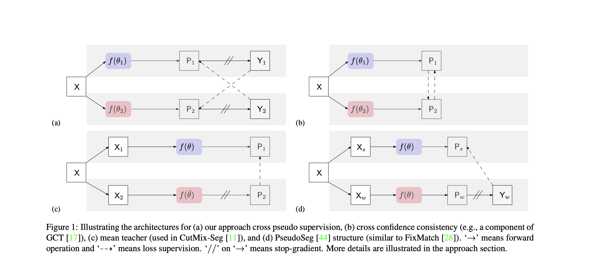

Figure 1(a)是该论文提出的方法。它由2个结构相同但参数初始化不同 (使用kaiming_normal进行两次随机初始化) 的网络构成。输入 $X$经过同样的augmentation (CutMix augmentation) 后输入这两个网络，输出为 $P_1,P_2$ (segmentation confidence map, which is the network output after softmax normalization). 接下来把 $P_1, P_2$转化为one-hot label map $Y_1,Y_2$.

训练过程包含两种losses:
- supervision loss $\mathrm{L}_s$: standard pixel-wise cross-entropy loss on the **labeled** images
- cross pseudo supervision loss $\mathrm{L}_{cps}$: (bi-directional, on **both unlabeled and labeled data**) $Y_1$ supervise $P_2$, $Y_2$ supervise $P_1$ 

总的loss: $\mathrm{L}=\mathrm{L}_s+\lambda\mathrm{L}_{cps}$.

# Experiments
Datasets: PASCAL VOC 2012, Cityscapes

Evaluation metric: mean Intersection-over-Union (mIoU)

Implementation: DeepLabv3+ (segmentation head) with ResNet-50 or ResNet-101

## Improvements over baselines
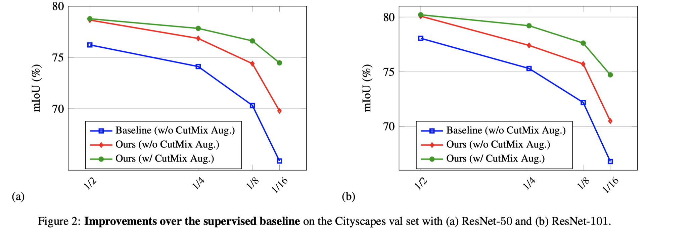
<!-- ?什么是supervised baseline -->
在Cityscapes上，使用不同的分割策略，以及是否加CutMix augmentation，对比论文方法与supervised baseline. 所有方法都based on DeepLabv3+  with ResNet-50 or ResNet-101.

## Comparison with SOTA
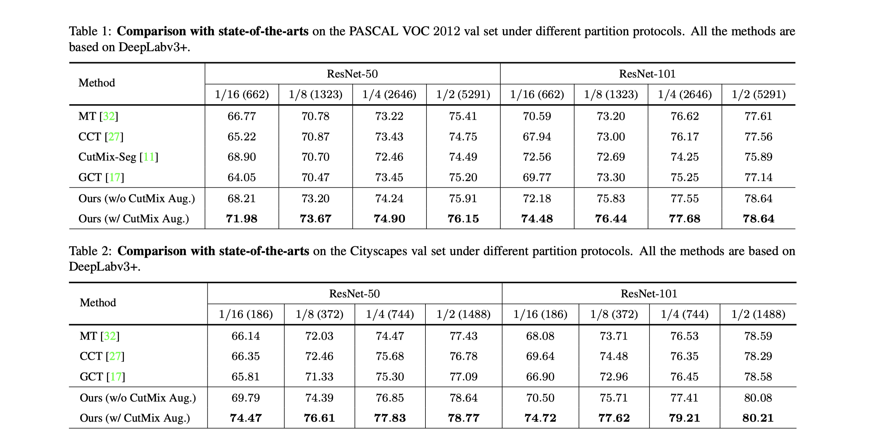
在Cityscapes和PASCAL VOC 2012上，使用不同的分割策略，以及是否加CutMix augmentation，对比论文方法与semi-supervised segmentation methods. 所有方法都based on DeepLabv3+  with ResNet-50 or ResNet-101.

## Improving Full- and Few-Supervision
### Full-supervision
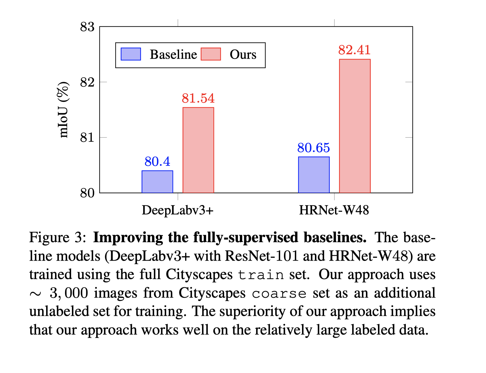
baseline models使用整个Cityscapes train set训练；论文方法使用整个Cityscapes train set和另外3000张unlabeled image (from Cityscapes coarse set)训练。

### Few-supervision
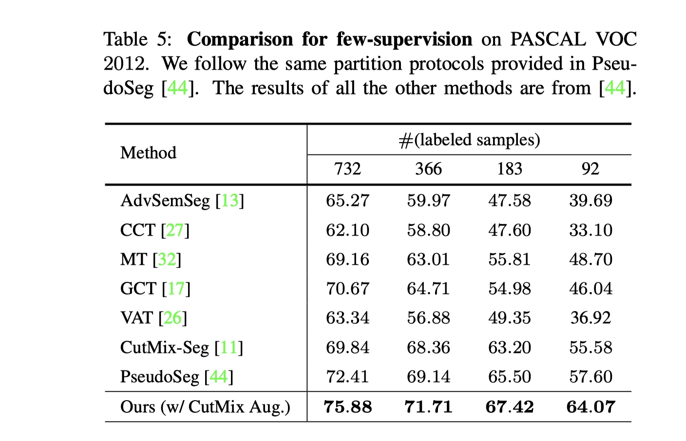
在使用少量labeled images和大量unlabeled images来训练的情况下，对比其他几个方法和论文方法。

## Empirical Study
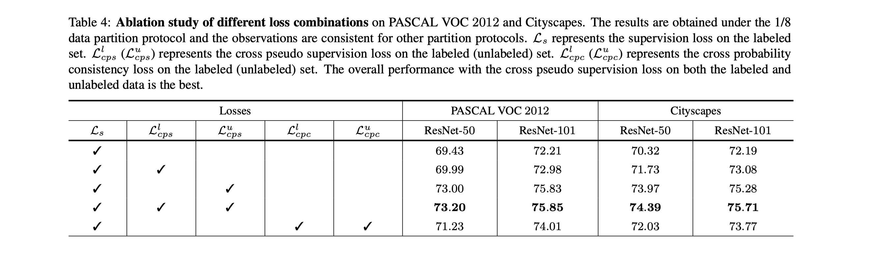
### Cross pseudo supervision
研究了cps loss作用于 labeled set/unlabeled set/both 带来的影响，见Table 4第3、4、5行。
<!-- cps loss作用于labeled set，是指完全代替ce loss吗? -->

### Comparison with cross probability consistency (CPC)
比较CPS loss与CPC loss (即Figure 1(b))，见Table 4最后两行。

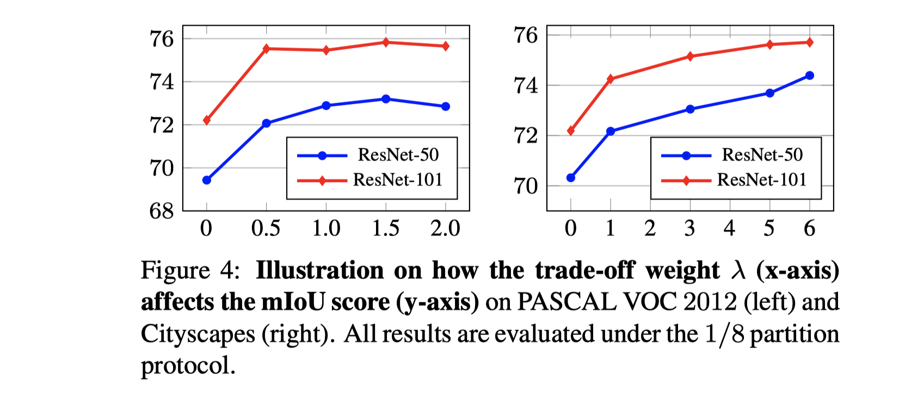
### The trade-off weight $\lambda$
Investigate the influence of different $\lambda$ that is used to balance the supervision loss and cross pseudo supervision loss, on the 2 datasets.

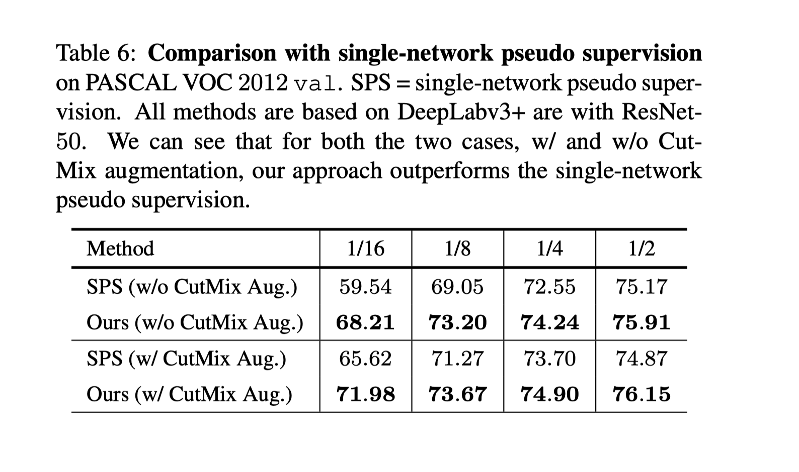
### investigate the influence of different $\lambda$ that is used to balance the supervision loss and CPS loss
对比CPS和single network pseudo supervision. (single-network pseudo supervision with the CutMix augmentation类似于FixMatch应用于语义分割，就像PseudoSeg. 作者认为这个结果说明了论文方法优于PseudoSeg.)

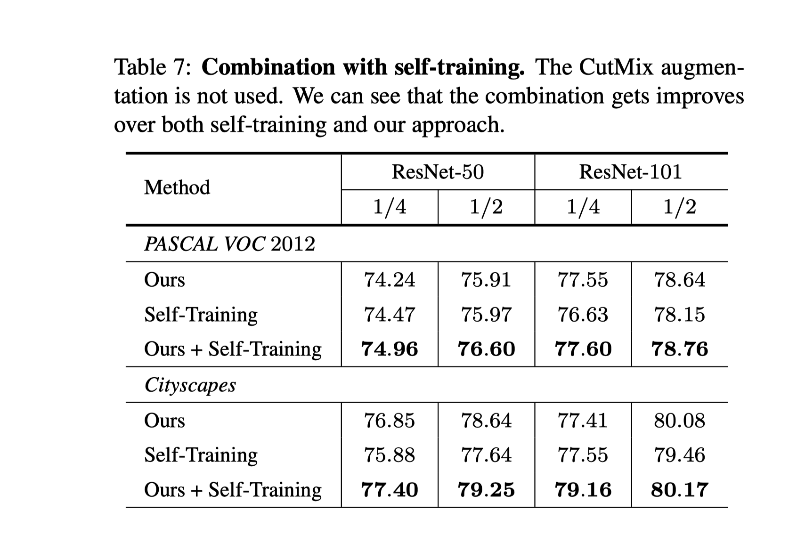
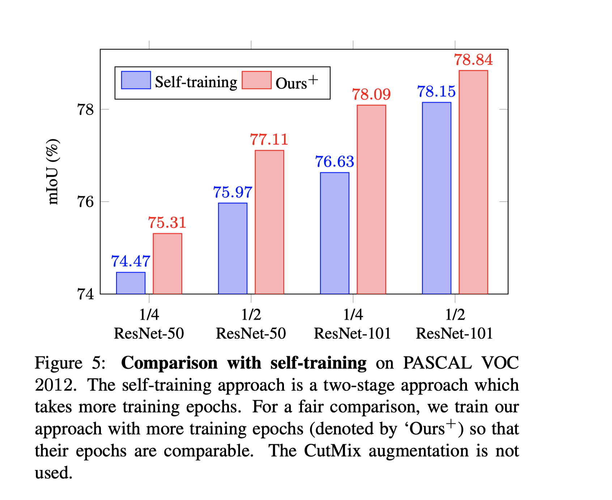
### Combination/comparison with self-training
Table 7对比仅使用CPS、仅使用self-training、两者结合训练的网络。

Figure 5对比Self-training、增加了额外epoch的CPS训练的网络。

## Qualitative Results
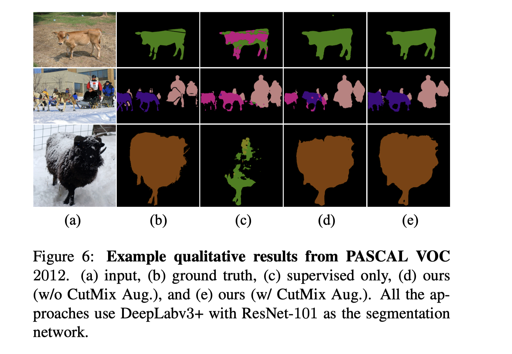
分割结果的可视化。