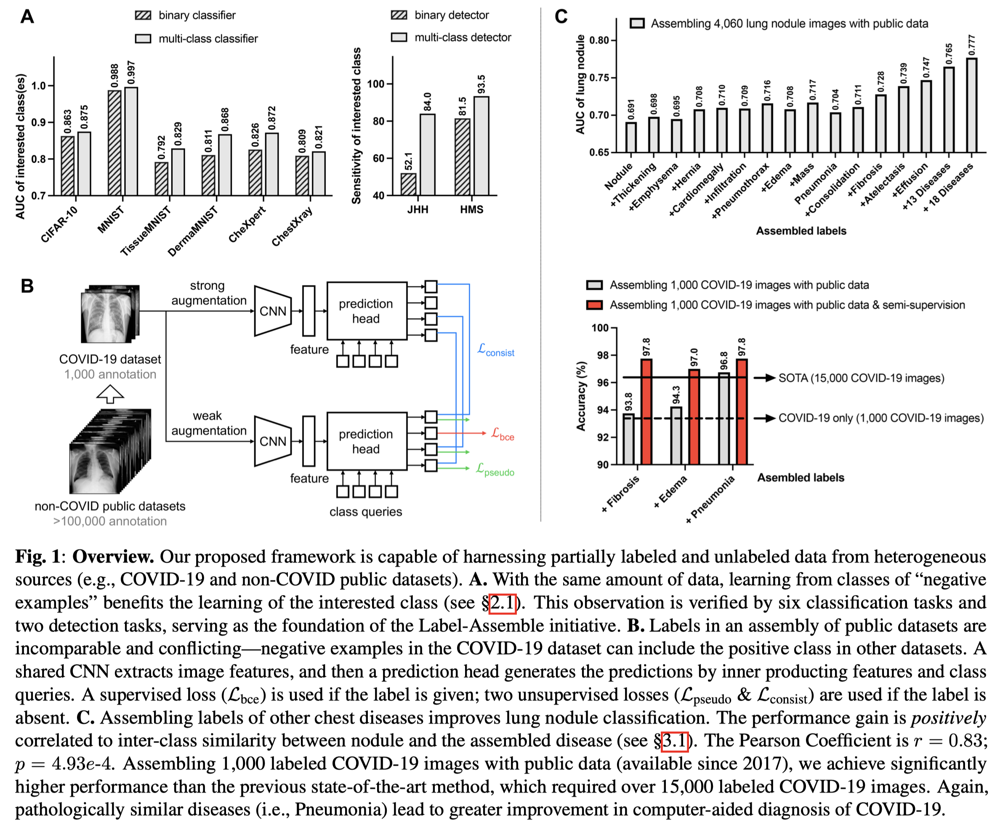

[LABEL-ASSEMBLE: LEVERAGING MULTIPLE DATASETS WITH PARTIAL LABELS](https://arxiv.org/abs/2109.12265)

# Motivation
目前许多公开的数据集都带有不完整的标注. 这些数据集的潜能还没有被完全释放.

为了解决这个问题，作者根据几个examples提出了以下假说：*a dataset that is labeled with various classes can foster more powerful models than one that is only labeled with the class of interest.* 基于这个假说，作者提出了一个名为"Label-Assemble"的新方法，整合多个带有partial label的数据集，并用于模型训练。

# Details

Figure 1(B)介绍了作者具体如何整合多个数据集，并训练一个分类模型.

以COVID-19数据集为例，1000张COVID-19图像与多于100,000张非COVID-19图像，混合后分别经过弱增强(weak augmentation)和强增强(strong augmentation), 输入到同一个的特征提取网络中。

提取到的feature经过一个线性层，映射成一个维数与类别相同的向量。这个向量经过softmax层之后得到的输出用作损失函数的输入。

- 这一步相当于feature与一个可学习的class query相乘。class queries的初始化为对应类的one-hot vector (即nn.Linear(in_features, out_features)中的权重矩阵，形状为(out_features, in_features)).
- 对应的代码中，对于 nn.Linear 模块的初始化，仅对偏置项参数(bias)进行了初始化，将其值设置为常数0，而权重矩阵(weight)的初始化则采用了默认的 Kaiming 初始化方式
  <!-- 既然是默认的Kaiming初始化，那为什么文章里说是"初始化为对应类的one-hot vector"? -->

如果输入的图像是有标签的，则在弱增强的这个分支中采用BCE loss; 如果图像是缺乏标签的，则在弱增强的这个分支上生成一个伪标签，并进行伪标签监督，同时与对应的强增强分支上的输出采用一致性损失 (consistency loss).

总的损失函数: $L_{total}=L_{bce}+L_{pseudo}+L_{consist}$.

# Experiments
Datasets: 
- 2 computer vision datasets (MNIST, CIFAR10)
- 7 public medical datasets (COVIDx CXR-2, CheXpert, ChestX-ray14, DermaMNIST, TissueMNIST, OrganAMNIST, RetinaMNIST) 
- 2 private medical datasets (JHH and HMS).

Evaluation Metrics: Area Under the Curve (AUC) for disease diagnosis, Sensitivity and Specificity for disease detection.

## Assembling partial labels improves disease diagnosis
- Figure 1(C)上半(结核图像以及13种不同图像)：研究了不同类别的 "阴性示例 "对性能的贡献程度：性能的提高与相关类别和新增类别之间的病理学相似性呈正相关。(相似度与性能增益之间的皮尔逊相关系数 (Pearson correlation coefficient) 为0.83，表明两者之间存在显著的正相关关系（p = 4.93e-4）)
- Figure 1(C)下半的灰色条(COVID-19诊断)也显示出类似结果。

除此之外，伪标签和一致性约束可以在很大程度上消除对类似疾病的要求，这表明组合任何胸部疾病（无论具体类别如何）都可以实现同样高的COVID-19诊断性能（见图1C中的红条）。这些结果还需要更多的研究。

## Assembling partial labels improves disease detection
Figure 1(A)右边部分：对于从CT扫描中检测PDAC这个任务，作者训练了两个模型：第一个模型只从背景中分割PDAC，第二个模型经过训练可从背景中分割所有三种类型的肿瘤。

## Combining partial labels vs. full labels

与2个部分标签方法(methods for partial labels)和完整标签方法(method for full labels)做比较。Table 1表明，论文方法使从部分标签学习的性能与从完整标签学习的性能相当，同时消除了40%的额外注释成本。

## Exceeding Prior Arts in NIH ChestX-ray14

在ChestXray-14数据集上，Label-Assemble达到最好的平均性能。
