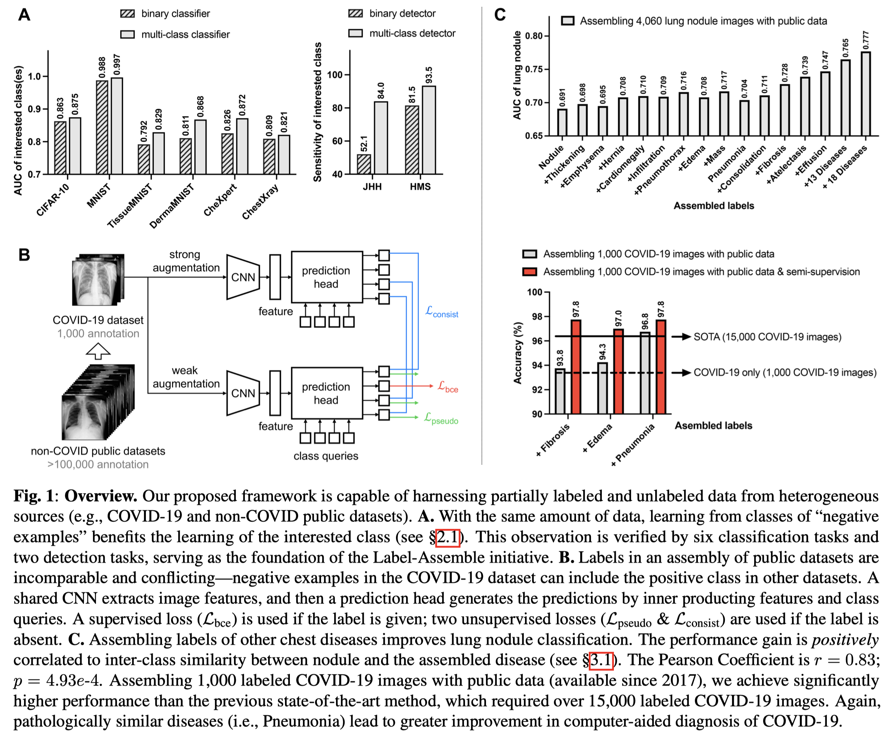
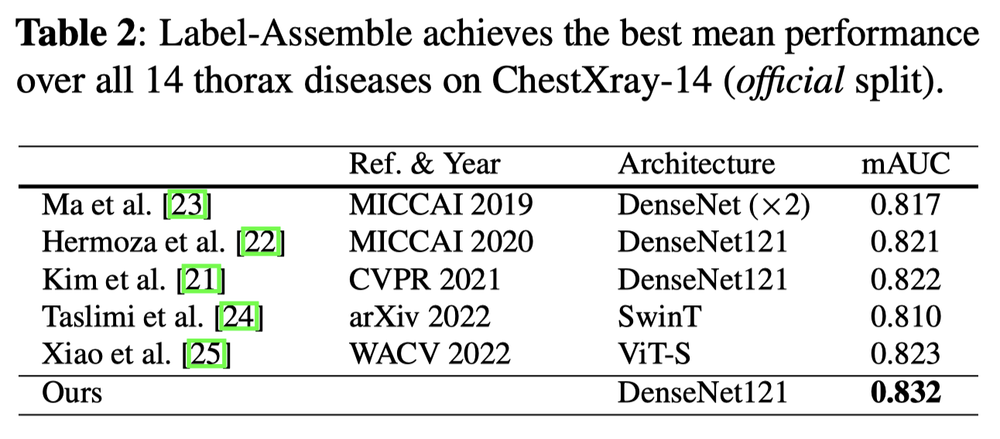

[LABEL-ASSEMBLE: LEVERAGING MULTIPLE DATASETS WITH PARTIAL LABELS](https://arxiv.org/abs/2109.12265)

# Motivation
目前许多公开的数据集都带有partial(incomparable, heterogeneous, or even conflicting) labels. 这些数据集的潜能还没有被完全释放.

为了解决这个问题，作者根据几个examples提出了以下假说：*a dataset that is labeled with various classes can foster more powerful models than one that is only labeled with the class of interest.* 基于这个假说，作者提出了一个名为"Label-Assemble"的新方法，整合多个带有partial label的数据集。通过在整合后的数据集上训练，多个模型的性能都得到了提升。

# Details

## A
为了验证上文提出的假说，作者使用了6个multi-class datasets, 分别在每个数据集上训练了a multiclass classifier和 a binary classifier(the interested class is labeled as positive, and the rest classes are negatives). 它们的唯一区别在于，对于binary classifier来说，负样本都是未知的(not fine-grained),而对于multi-class classifier来说，负样本的组成已知.

根据实验结果，作者得出结论：*learning from the classes of “negative examples” can better delimit the decision boundary of the class of interest.*

## C
一般来说，我们不会想到去使用与感兴趣的类无关的标签。但是作者发现，在训练时使用这些看似无关的图像和标签，有助于增强模型的性能、减少annotation efforts，如**C**部分所示。

## B
这一部份介绍了作者具体如何整合多个数据集，并训练模型.

输入的图像经过一个shared CNN进行特征提取，提取的特征和[class queries]在一个prediction head里进行内积. 如果图像有label，则采用binary cross entropy(bce) loss: 
$\mathcal{L}_{bce}$;

如果没有，则用sharpening operator 生成一个pseudo-label，并采用 $\mathcal{L}_{pseudo}$. 

另外，对于weakly augmented($a_w$) 和strongly augmented($a_s$) images, 还采用了consistency loss $\mathcal{L}_{consist}$. 

最后，总的loss function由binary cross-entropy regularization for annotated labels和pseudo labels & consistency constraints for unlabeled ones组成: $L_{total}=L_{bce}+L_{pseudo}+L_{consist}$.

# Implementation & Validation
**Datasets**: 2 computer vision datasets (MNIST, CIFAR10), 7 public medical datasets (COVIDx CXR-2, CheXpert, ChestX-ray14, DermaMNIST, TissueMNIST, OrganAMNIST, RetinaMNIST), and 2 private medical datasets (JHH and HMS).

**Evaluation Metrics**: Area Under the Curve (AUC) for disease diagnosis, sensitivity and specificity for disease detection.

## Results

**Conclusion**: **it is not necessary to complete the missing labels in an assembly of multiple partially labeled datasets.**

