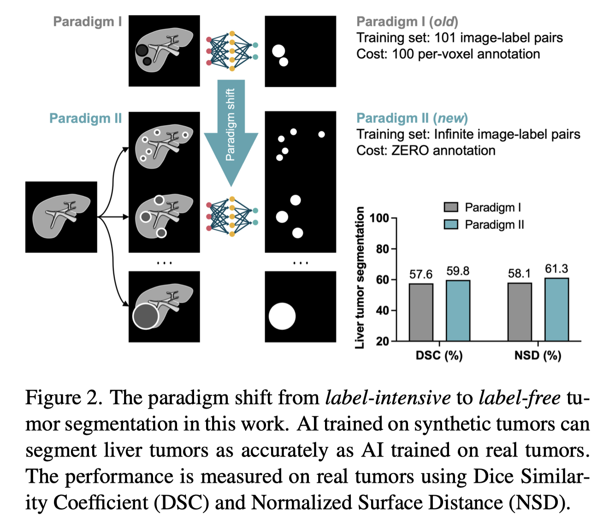
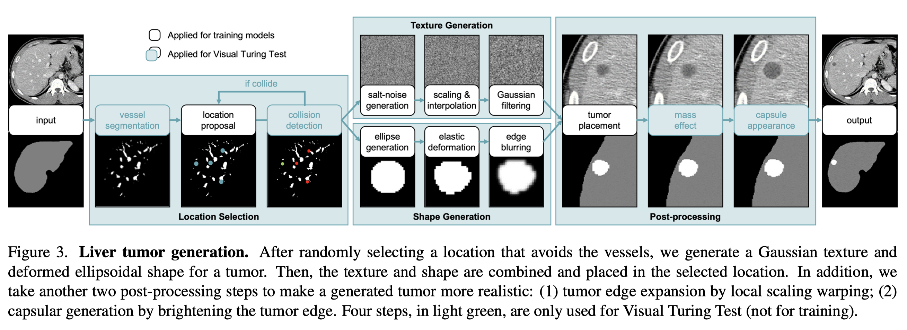
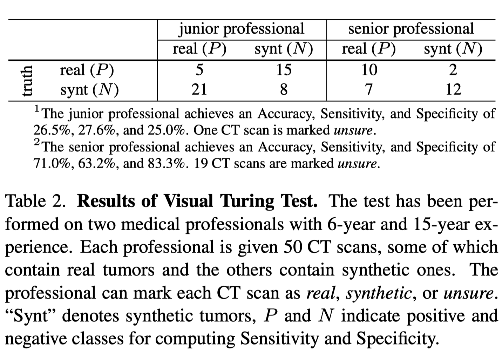
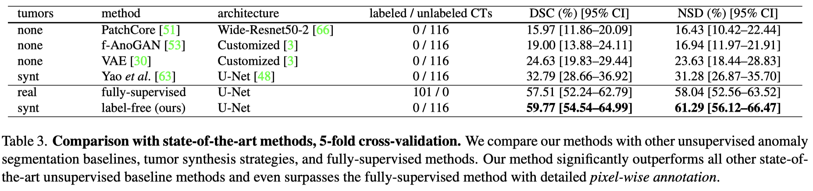
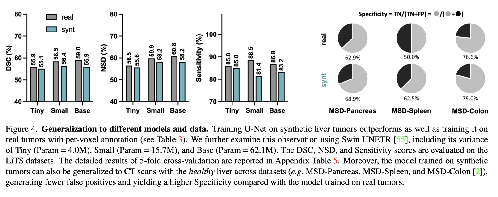
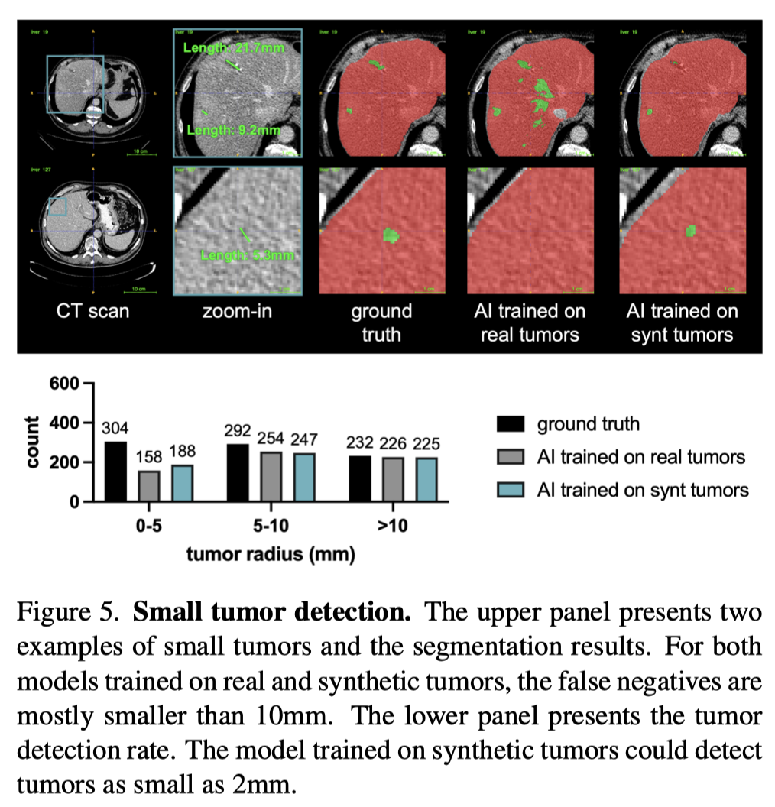
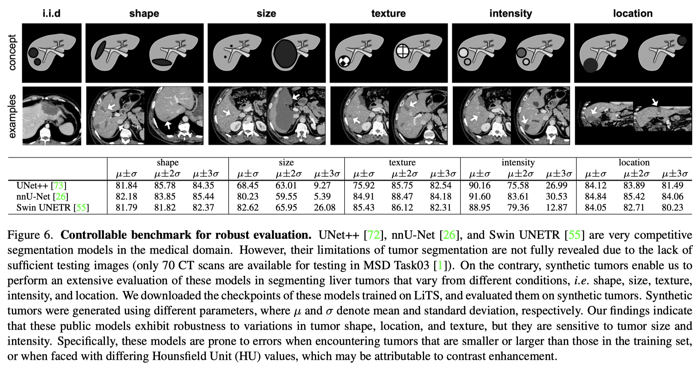
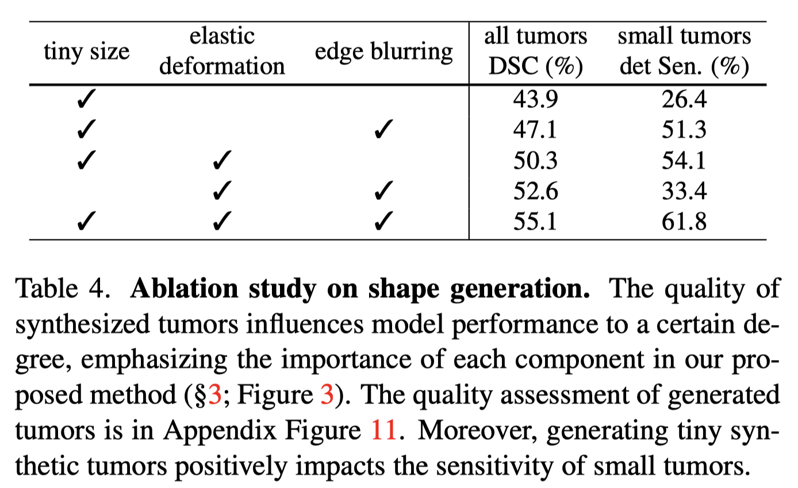

[Label-Free Liver Tumor Segmentation](https://arxiv.org/abs/2303.14869)
 - [Label-Free Supervision](https://blog.csdn.net/BVL10101111/article/details/77996225)(训练时，不使用任何标签数据) 出处: [Label-Free Supervision of Neural Networks with Physics and Domain Knowledge](https://arxiv.org/abs/1609.05566) (AAAI 2017的best paper)

---
# Motivation, Challenge, Insight & Solution

  
训练一个用于医学图像分割的AI model常常依赖于标注良好的数据集。然而，标注医学图像不仅耗时耗力，还需要很强的专业知识。虽然目前已经有一些生成合成肿瘤(generating synthetic tumors)的尝试，但这些方法生成的图像和真实图像相差较大，且用它们来训练的模型在测试数据上的表现也不好。

为了生成可以替代真实肿瘤图片的合成图片，作者关注了合成肿瘤的四个重要特征：shape, intensity, size, location, and texture，并基于以上特征设计了一个合成方法。该方法主要有以下优点：
 - 合成的图像通过了视觉图灵测试
 - 使用合成图像训练的网络，比使用真实图像训练的网络，在测试时表现更好

---
# Details
## Method: tumor generation

将健康的肝脏的CT图转化成包含肿瘤的CT图的过程如下：

0. 用pre-trained [nnUNet](https://zhuanlan.zhihu.com/p/100014604)得到粗略的肝脏分割掩码图
1. **Location selection**: 选择一个不包含任何血管的位置
    用voxel value thresholding(a method of [Digital image processing](https://en.wikipedia.org/wiki/Digital_image_processing#:~:text=Digital%20image%20processing%20is%20the,advantages%20over%20analog%20image%20processing.))分割血管位置. 
   
    Segmented vessel mask公式为: $$v(x,y,z)=\begin{cases}1,\;f'(x,y,z)>T,\;l(x,y,z)=1\\0,\;otherwise\end{cases}$$其中$f'(x,y,z)=f(x,y,z)\otimes g(x,y,z;\sigma_a)$ 是smoothed CT scan, $g(x,y,z;\sigma_a)$ 是Gaussian filter with standard deviation $\sigma_a$, $\otimes$ 
    是standard image filtering operation. [Threshold] $T$被设置为比mean Hounsfield Unit(UT) *(UT: 用于衡量组织或物质在CT图像中的相对密度)* 略大的值: $T=\overline{f(x,y,z)\odot l(x,y,z)}+b$, 其中 $l(x,y,z)$ 是liver mask(background=0, liver=1), $\odot$ 是point-wise multiplication, $b$ 是超参数.

    有了vessel mask, 当我们随机地选取肝脏区域内的一个点 $(X,Y,Z)$时，就可以检测在tumor radius $r$ 范围内是否有血管. 如果有，则再随机选取一个点进行检测.
2. **Texture generation**: 生成近似于真实组织的纹理

    真实肝脏和肿瘤的纹理服从Gaussian distributions. 因此，首先基于已定义的HU强度$\mu_t$和标准差$\sigma_p$生成3D [Gaussian Noise](https://ai.plainenglish.io/what-is-gaussian-noise-in-deep-learning-how-and-why-it-is-used-af3730449e3a) 作为不包含血管的组织的纹理 $T(x,y,z)\sim \mathcal{N}(\mu_t,\sigma_p)$, 并且soften the texture, soften之后的纹理记为 $T'(x,y,z)$ . 最后blur the texture with Gaussian filter $g(z,y,z;\sigma_b)$: $$T''(x,y,z) = T'(x,y,z)\otimes g(z,y,z;\sigma_b)$$其中$\sigma_b$是标准差.
3. **Shape generation**: 生成椭圆形状的tumor mask
    
    该mask位于 $(x_t,y_t,z_t)$, $x,y,z$方向的半轴长分别通过对均匀分布 $U(0.75r, 1.25r)$ 随机采样得到. 然后对该mask进行弹性形变以丰富diversity，最后对mask应用一个Gaussian filter进行blur，得到 $t''(x,y,z)$.
4. **Post-processing**: 将tumor $t''(x,y,z)$, scanning volumn $f(x,y,z)$和 liver mask $l(x,y,z)$ 进行合成，得到:
   1. new scanning volumn $f'(x,y,z)=(1-t''(x,y,z))\odot f(x,y,z)+t''(x,y,z)\odot T''(x,y,z)$
   2. new mask with tumor(background=0, liver=1, tumor=2) $l'(x,y,z)=l(x,y,z)+t''(x,y,z)$
   
   合成完之后，再根据[mass effect](https://link.springer.com/10.1007/978-0-387-79948-3_253#:~:text=Mass%20effect%20is%20a%20phenomenon,within%20the%20restricted%20skull%20space.)(the expanding tumor pushes its surrounding tissue apart)和capsule appearance进一步调整.

---
# Implementation & Verification
**Dataset**: [LiTS](https://paperswithcode.com/dataset/lits17)

**Evaluation Metrics**: 
 - 肿瘤分割: Dice similarity coefficient ([DSC](https://en.wikipedia.org/wiki/S%C3%B8rensen%E2%80%93Dice_coefficient)) and Normalized Surface Dice (NSD) with 2mm tolerance
 - 判断该肿瘤图片是真实还是合成: [Sensitivity and Specificity](https://en.wikipedia.org/wiki/Sensitivity_and_specificity)
   - **Sensitivity** (true positive rate) is the probability of a positive test result, conditioned on the individual truly being positive.
   - **Specificity** (true negative rate) is the probability of a negative test result, conditioned on the individual truly being negative.

以上评估指标都计算了[95%的置信区间，并设定显著性水平为0.05](https://manual.sensorsdata.cn/abtesting/latest/abtesting_ConfidenceInterval-110297837.html).

**Implementation**: Based on the [MONAI](https://monai.io/) framework for both U-Net and [Swin UNETR](https://arxiv.org/abs/2201.01266)

## Results
1. **Clinical Validation using Visual Turing Test**

对50张CT扫描图进行[视觉图灵测试](https://en.wikipedia.org/wiki/Visual_Turing_Test)，其中20张扫描图是来自LiTS的真实肿瘤，其余30张扫描图是来自[WORD](https://github.com/HiLab-git/WORD)的健康肝脏并进行肿瘤合成。

具体地说，两名具有不同经验水平的专业人员在三维视图中检查每个肿瘤样本，将每个样本标记为real、synthetic或unsure。在计算Sensitivity and Specificity时，不考虑unsure的样本。

表中结果显示，对于初级专家，虽然50个样本中有49个样本都得到了明确的判断，但各项评价指标的结果都低于30%，表明他不能很好的区分合成样本和真实样本；对于高级专家，50个样本中有19个样本被标为unsure，意味着这些样本成功混淆了高级专家。

2. **Comparison with State-of-the-art Methods**

<!-- QUESTION: 这几个方法各自是怎么work的?为什么要用它们进行比较? -->
<!-- QUESTION: 这篇文章是怎么使用合成的图片进行unsupervised tumor segmentation？ -->
这一部分将文章提出的label-free肿瘤合成策略与几个[unsupervised]肿瘤分割方法、另一个label-free合成策略、全监督方法进行比较。

可以看到，其他方法最终训练出来的网络效果都不如使用了文章提出的合成策略来训练的网络。

3. **Generalization to Different Models and Data**
 

为了"verify the generability of synthetic tumors", 作者使用不同数据集训练了不同模型。
   - Figure 3的最后两行：在合成图和真实图(101 CT scans and annotations from LiTS)上训练U-Net 
   - Figure 4(左): 在合成图和真实图(同样取自LiTS)上训练Swin UNETR的三个变种。虽然在真实图上训练的模型表现更好，但是该结果的p-value > 0.5, 两个模型的性能不存在statistical difference.
   - Figure 4(右) (第一行：real data only from LiTS；第二行：healthy data collected from 3 different datasets): 在另外三个数据集上evaluate the models. 结果显示，使用了来自其他数据集的健康图像训练的模型表现出更好的robustness，并取得了更高的Specificity. 后者在医学上很重要(因为high Specificity -> fewer false positives).

4. **Potential in Small Tumor Detection**
 

合成肿瘤的另一个优点是能够生成不同大小的肿瘤，用于训练和测试模型。真实数据集的缺点在于，由于大多数患者在早期阶段没有症状，包含小肿瘤的图像在真实数据集里不常见。因此，在真实数据集上训练出来的模型对小肿瘤的Sensitivity(52%)比大肿瘤的(91.6%)低. 

Figure 5的上半部分是两个small tumor detection的例子，下半部份是两种模型(trained on real/synthetic)分别检测3种不同大小的肿瘤的结果。

5. **Controllable Robustness Benchmark**

合成肿瘤还可以用来评估AI在检测各种不同大小、位置的器官中的肿瘤的性能。本文生成了在5个维度(location, size, shape, intensity, and texture)上不尽相同的肿瘤。通过这样全面的evaluation, 我们可以找到现有的AI模型的failure scenarios，然后在训练集中加入对应的worst-case tumors并微调算法。

Figure 6是对3个已经训练好的模型的evaluation. $\mu$ 和 $\sigma$ 代表合成肿瘤使用的参数，表中数值(应该是)代表Sensitivity. 这些结果可以作为out-of-distribution (o.o.d.) benchmark.

            分布外泛化（Out-of-Distribution Generalization，简称OOD泛化）旨在解决训练数据与测试数据分布不一致的问题，即模型需要基于有限观测数据学习出背后稳健的规律与关联性，从而泛化到未知数据分布。

            (？表中第一列的i.i.d应该代表independent and identically distribution, 与ood对应)

6. **Ablation Study on Shape Generation**
  

对肿瘤合成过程采用的三个策略，以及是否生成小肿瘤，进行了Ablation Study.