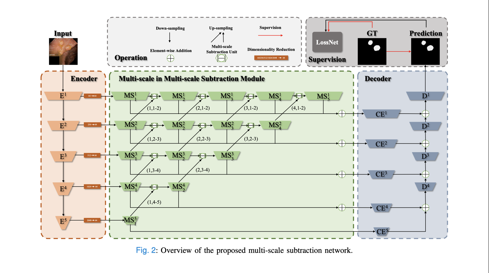

[M2SNet: Multi-scale in Multi-scale Subtraction Network for Medical Image Segmentation](https://arxiv.org/pdf/2303.10894.pdf)

# Motivation
医学图像分割面临3个挑战:
- U-Net以及其改进网络一般使用简单的操作(比如元素加法)来融合来自解码器不同层级的特征。但是这些操作没有关注不同层级的特征之间的差异，导致产生冗余信息、削弱层级特征，使网络兼顾精确定位和边界重构。
- 单尺度的卷积核难以捕捉大小可变物体的上下文信息。但目前的方法会产生许多额外的参数和计算。
- 损失函数的设计非常耗时，且对训练技能要求很高。

因此，作者设计了一个用减法聚合来融合不同层级特征的网络，并且构建了一个通用的免训练损失网络。

# Details

# Experiments
