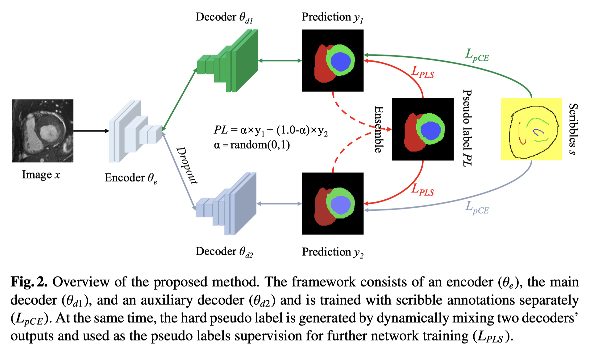
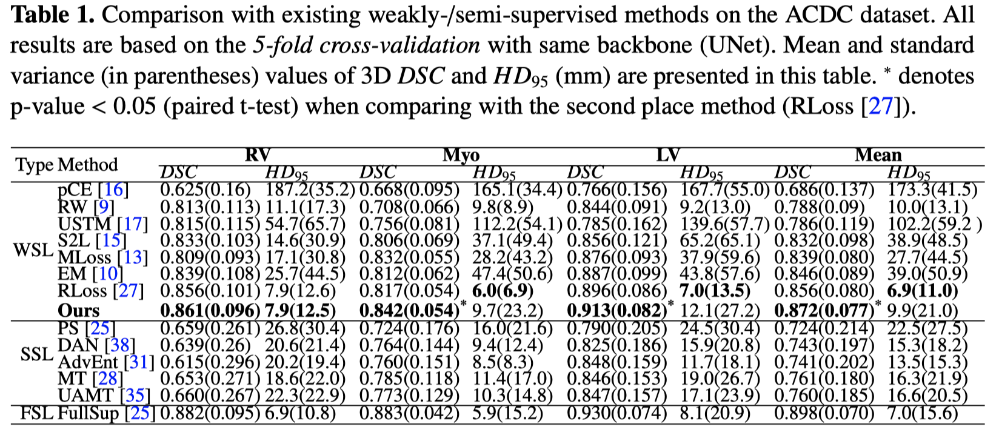
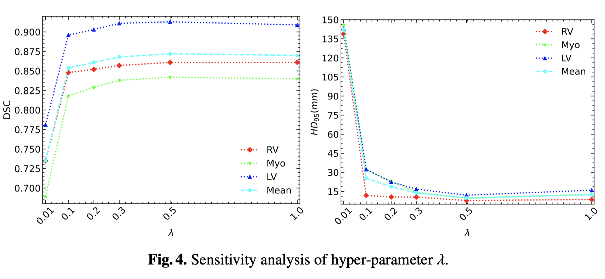
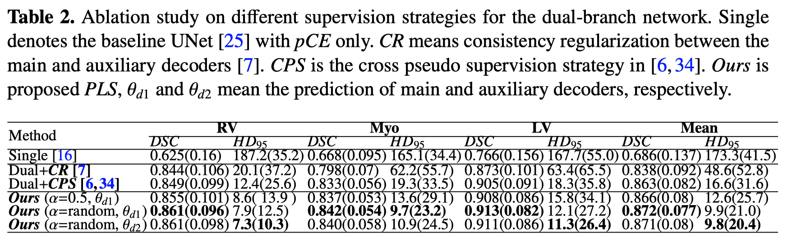

[Scribble-Supervised Medical Image Segmentation via Dual-Branch Network and Dynamically Mixed Pseudo Labels Supervision](https://arxiv.org/abs/2203.02106)

---
# Motivation, Challenge, Insight & Solution
**Motivation**: In automatic medical image segmentation, CNN/Transformers have achieved encouraging results. 
   - **Challenge1**: But, collecting a large-scale and carefully annotated medical image dataset is expensive and time-consuming.
   - **Insight1**: Collecting sparse annotations is easier than dense annotations, and scribbles have better generality to annotate complex objects than bounding boxes and points.
   - **Solution1**: This paper proposed a (dual-branch) network to learn from scribble annotations.
     - **Challenge2**: However, the performance (using scribble annotations) is still lower than training with dense annotations.
     - **Insight2**: Semi-supervised learning can benefit from high-quality pseudo labels.
     - **Solution2**: Therefore, the proposed network is first trained with scribble annotations, ignoring unlabeled pixels. It then uses predictions as hard pseudo-labels, combining scribbles supervision and pseudo-labels supervision to train the segmentation network end-to-end.
       - **Challenge3**: There is still another problem: the inherent weakness of previous pseudo-labeling methods that the model retains the prediction from itself and thus resists updates.
       - **Insight3**: Recently, some works resort to perturbation-consistency strategy for semi-supervised learning to solve this problem (*how?*)
       - **Solution3**: The proposed network generates hard pseudo labels by dynamically mixing two branches’ predictions randomly, which is *assumed* to be able to go against the above inherent weakness, as these auxiliary branches are added perturbations and do not enable interaction with each other.

---
# Details

## Components
The network consists of one encoder and two decoders:

1. The encoder $\theta_e$ is used for feature extraction.
2. Two decoders ($\theta_{d1}$ (used for segmentation),$\theta_{d2}$(used for supplementary training)), respectively. 
   
   $\theta_e$ and $\theta_{d1}$ come from the general [UNet](https://github.com/milesial/Pytorch-UNet), while $\theta_{d2}$ is embedded into UNet as a perturbed decoder, where the droupout is used to introduce perturbation at the feature level.
   
   This design has 2 advantages:
   - It can be against the inherent weakness of pseudolabel in the single branch network, as the two branches’ outputs are different due to the feature perturbation.
   - It can generate pseudo-label by two outputs ensemble but does not require training two networks, and the encoder benefits from the two individual supervisions to boost the feature extraction ability.

## Training Process
The training process consists of two procedures:
1. General scribble-supervised learning: use scribbles to train CNNs directly by minimizing a partial cross-entropy loss:
   $$L_{pCE}(y,s)=-\Sigma_{c}\Sigma_{i\in\omega_s}\log y_i^c$$
   where $s$ represents the one-hot scribble annotations. $y_i^c$ is the predicted probability of pixel i belonging class c. $\omega_s$ is the set of labeled pixels in s.
2. Pseudo labels to assist the network leaning: the two decoders' outputs are used to generate [hard pseudo labels](https://ai.stackexchange.com/questions/9635/what-is-the-definition-of-soft-label-and-hard-label) by mixing two predictions dynamically:
    $$PL=argmax[\alpha\times y_1 + (1.0-\alpha)\times y_2],\;\alpha=random(0,1)$$
    where $PL\coloneqq$ dynamically mixed pseudo labels, $y_1,y_2\coloneqq$ outputs of decoder 1,2.

    The generated $PL$ is used to supervise $\theta_{d1}$ and $\theta_{d2}$. The Pseudo Labels Supervision (PLS) is defined as:
    $$L_{PLS}(PL, y_1, y_2)=0.5\times(L_{Dice}(PL, y_1)+L_{Dice}(PL,y_2))$$
    where $L_{Dice}\coloneqq$ dice loss.

Finally, the total loss is:
$$L_{total}=0.5\times(L_{pCE}(y_1,s)+L_{pCE}(y_2,s)) + \lambda\times L_{PLS}(PL,y_1,y_2)$$
$\lambda$ is a weight factor to balance the supervision of scribbles and pseudo labels.

---
# Implementation & Verification
## Dataset
[ACDC](https://paperswithcode.com/sota/medical-image-segmentation-on-automatic) via [five-fold cross-validation](https://scikit-learn.org/stable/modules/cross_validation.html), employ the 2D slice segmentation rather than 3D volume segmentation, as the thickness is too large.

## Implementation Details
- Backbone network: UNet
- Added the dropout layer (ratio=0.5) before each conv-block of the auxiliary decoder to introduce perturbations.

## Quantitative Analysis

1. Part1: Compare with 7 weakly supervised learning (WSL) methods. It can be found that our method achieved the best performance in terms of mean DSC (p-value < 0.05) and second place in the HD 95 metric than other methods.
2. Part2: Compare with 4 semi-supervised learning (SSL) methods. It shows that the scribbled annotation can achieve better results than pixel-wise annotation when taking a similar annotation budget.
3. Part3: also investigated the upper bound when using all mask annotation to train models (FullSup) in the last row of Table 1. It can be found that the proposed method is slightly inferior compared with fully supervised learning with pixel-wise annotation.

## Sensitivity Analysis of $\lambda$

All these results are based on the 5-fold crossvalidation. It can be observed that increasing λ from 0.01 to 0.5 leads to better performance in terms of both DSC and HD 95 . When the λ is set to 1.0, the segmentation result just decreases slightly compared with 0.5 (0.872 vs 0.870 in term of mean DSC). These observations show that the proposed method is not sensitive to λ.

## Ablation Study
Investigated the effect of using different supervision approaches for the dual-branch network:
1. Consistency Regularization (CR) that encourages the two predictions to be similar, directly.
2. Cross Pseudo Supervision (CPS) that uses one decoder’s output as the pseudo label to supervise the other one.
3. The proposed approach dynamically mixes two outputs to generate hard pseudo labels for two decoders training separately.

It can be observed that compared with CR and CPS, using the proposed PLS leads to the best performance. 

Moreover, the paper also investigated the performance when α is set to a fixed value (0.5) and dynamic values. The result demonstrates the effectiveness of the proposed dynamically mixing strategy and the main ($\theta_{d_1}$) and auxiliary ($\theta_{d_2}$) decoders achieve very similar results.