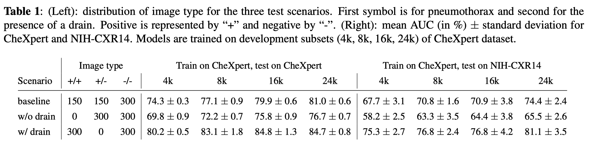
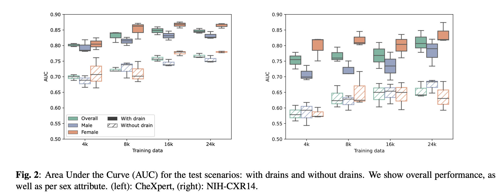
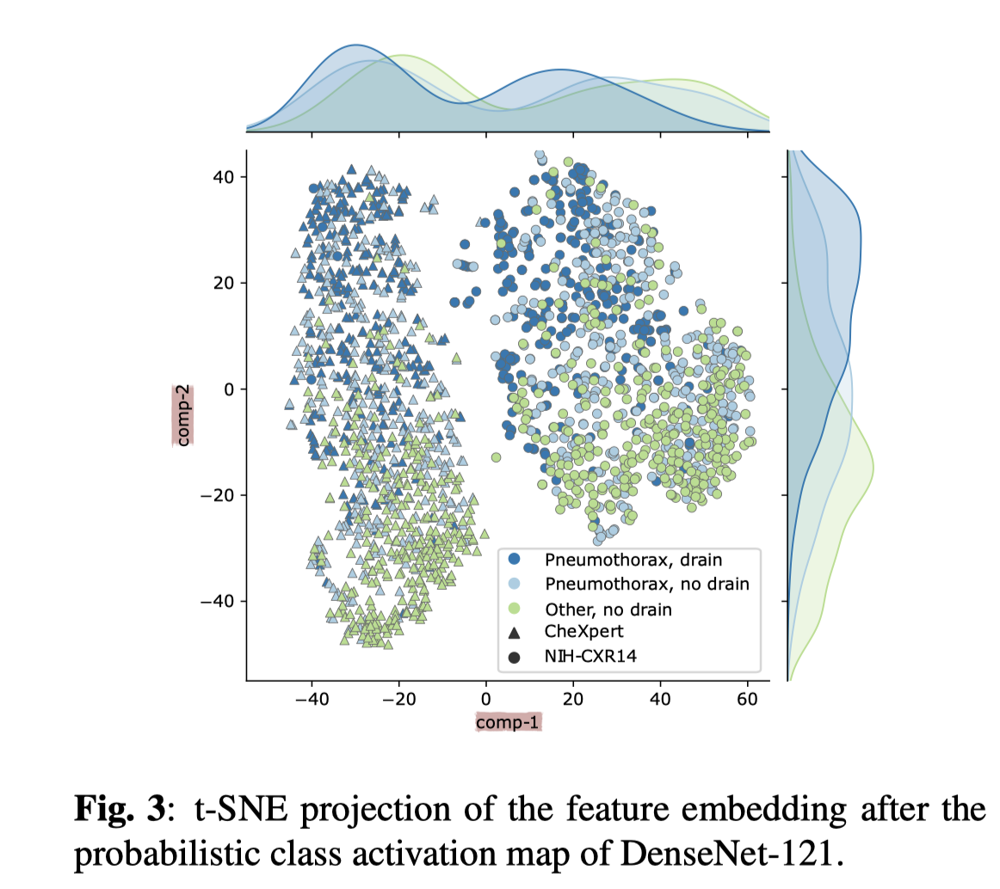

[DETECTING SHORTCUTS IN MEDICAL IMAGES - A CASE STUDY IN CHEST X-RAYS](https://arxiv.org/abs/2211.04279)

# Motivation
To highlight the importance of detecting and mitigating shortcuts.

# Method
## Summarization of Methods to Detect Shortcuts
1. inspecting the data itself
2. studying the behavior of a trained model

## Experiment

