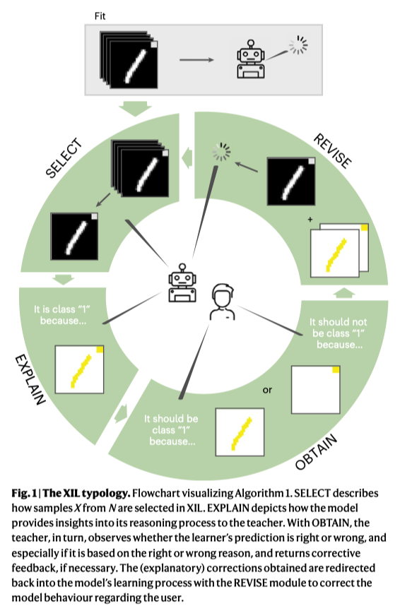

[A Typology for Exploring the Mitigation of Shortcut Behavior](https://www.nature.com/articles/s42256-023-00612-w)

# Typology for XIL
XIL = XAI + active learning. XAI focuses on generating explanations from the model, whereas XIL aims to reverse the flow and inserts user feedback on these explanations back into the model.

## Algorithm: the XIL pipeline

- A: annotated examples
  - annotation = classification label y + explanation E
- N: non-annotated examples
- X: samples
- T: iteration budget
- $\hat{y}$: predicted label
- f: learner (e.g. a CNN)
- $\overline{C}$: correction / feedback (based on X, $\hat{y}$, $\hat{E}$)
- $\hat{E}$: explanation given by model
- $\overline{E}$: explanation given by teacher

### SELECT
Describes how and how many X are selected from N.
- manually
- randomly
- with a specific strategy (e.g. via certaint)
### EXPLAIN
Depicts how the model provides insights into its reasoning process and the capability of an XIL method to facilitate the use of different model types (i.e. model specific or model agnostic).
### OBTAIN
Transform $\overline{E}$ into $\overline{C}$, enables the teacher to observe whether the learner's prediction is right or wrong, also check if the prediction is based on the right or wrong reasoning.
### REVISE
Redirect the corrections back in to the model's learning process.

# Results
- For the ISIC19 dataset, no XIL method helps a model improve the accuracy on the test set.
