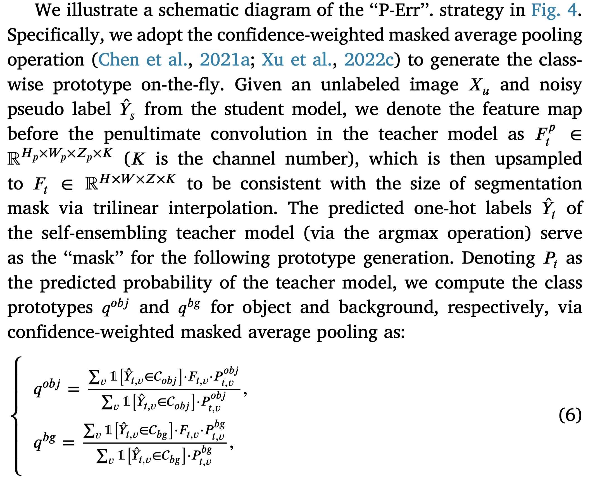
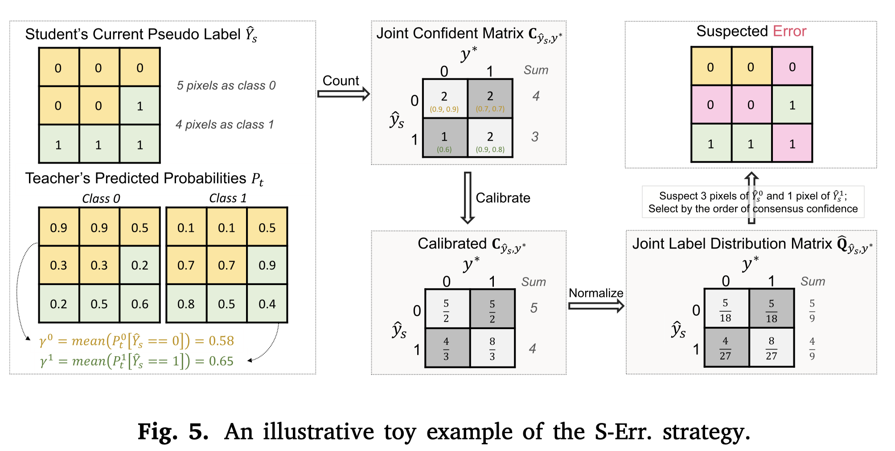

# Ambiguity-selective consistency regularization for mean-teacher semi-supervised medical image segmentation
## Overview
现有的基于mean teacher的模型很少有关注目标选择 (target selection), 即Consistency regulation应该把哪些体素 (voxel) 考虑到。因此作者假设那些分类波动性比较大的区域，即模糊区域 (ambiguous regions)，应该被更多关注 (文中的consistency loss只计算这些区域)。

作者挑选模糊区域的方法是几个即插即用的策略，分别从熵、模型不确定性和噪声标签自识别 (entropy, model uncertainty and label noise self-identification) 的角度考虑, 不增加训练参数，也不改变模型架构。之后，将估计的模糊图纳入一致性损失，以鼓励两个模型在这些区域的预测达成共识。

## Methodology
模型基于mean teacher架构，在计算consistency regulation时，考虑到ambiguity map.计算ambiguity map的方法有如下几种：

### prospective of Entropy
High Softmax Entropy (Ent.): 主干网络softmax层会产生逐像素的类别概率预测。于是，针对每个学生模型产生的像素(概率记为 $p_s$)，我们都可以计算一个正则化熵(normalized entropy):$$ne_v=-\sum_{c\in C} p_s^c log(p_s^c)/log(|C|)\in [0,1]$$, 其中c是语义类别。

高的熵值意味着模型在这个像素的位置是相对混乱的，这个像素的预测是困难的。因此，ambiguity map仅选择 $ne_v>H$ (H是经验阈值) 的像素。

### prospective of Model Uncertainty
High model uncertainty (MU): 采用Monte-Carlo dropout, 即启用droupout layers，使用student进行T个随机前向传播过程，获得一个概率向量的集合 $\{p_s\}_{t=1}^T$, 然后依旧计算正则化熵，得到每个像素的不确定性:$$u_v=-\sum_{c\in C}(\frac{1}{T}\sum_t p_s^c)log(\frac{1}{T}\sum_t p_s^c)/log(|C|)\in[0,1]$$同样的，选择熵大于H的像素作为ambiguity map.

<!-- T=1时退化成 ne_v -->

### prospective of Label Noise Self-identification
1. Prototype-guided label noise identification (P-Err.)

    该方法不使用purturbation, 而是让student生成即时的pseudo-label , 同时用teacher辅助识别student的错误。这种策略基于如下假设：对于一个正确的有标注的像素，它的特征应该离对应的类原型更近；否则，它可能就是一个潜在的标签噪声。

    具体过程是：采用confidence-weighted masked average pooling operation生成即时的类原型

    
    然后计算第v个特征向量和两个原型的距离，从而得到ambiguity map (如果第v个像素的由student生成的伪标签是object，然而它的特征向量离background prototype更近，那么它可能就被错误标注了；反之亦然)。

2. Class-conditional systematic label noise identification (S-Err.)

    受confident learning启发，作者修改了CNP假设以适应分割任务：假设每个像素都有一个真实的（潜在）标签，且类别$j\in L$中的每个标签都可以被独立地错误标注为类别$i\in L$，概率为 $p(y=i|y^*=j)$. 更进一步，作者结合了Random Walk的思想去估计联合概率$p(y=i|y^*=j)$, 用于计算图像X中可能的错误标注像素的数量。
    
    

## 补充
- Entropy