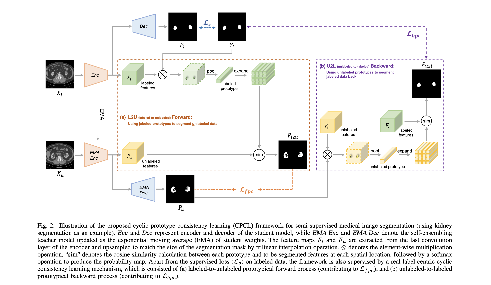

# All-Around Real Label Supervision: Cyclic Prototype Consistency Learning for Semi-supervised Medical Introduction
supervised-like consistency via prototypical network

本文提出了一种新的regulation consistency方法, 不采用purturbation (即无监督学习的方法)，而是使用原型学习的思想，采用一种更像有监督学习的方法。

## Method
Total loss: $L_s+\lambda(L_{fpc}+\beta L_{bpc})$
### Cyclic Prototype Consistency Learning
1. **L2U**(use labeled prototype to segment unlabeled data): 首先通过掩码平均池化操作生成原型分割(prototype segmentation)，然后对特征和原型分割计算余弦相似度并取softmax得到原型预测(prototype prediction)图 $P_{l2u}$, 于是就可以计算 $L_{fpc}=L_{mse}(P_{l2u},P_u)$
2. **U2L**(vise versa)：与L2U过程类似，只是多了一步用argmax获得unlabeled data的预测的伪标签，最后 $L_{bpc}=L_{ce}(P_{u2l},Y_l)$