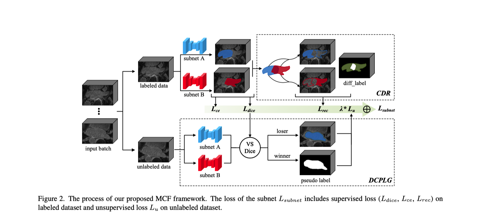
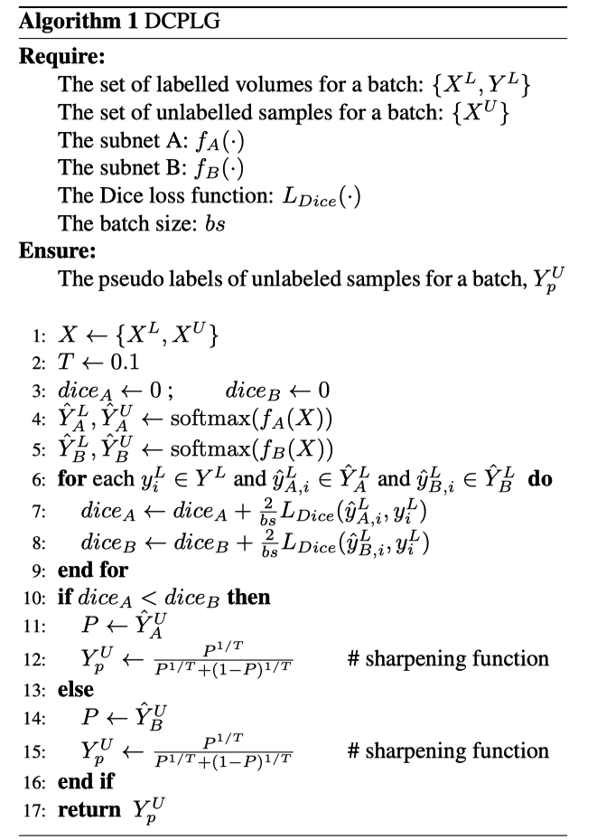

# MCF: Mutual Correction Framework for Semi-Supervised Medical Image Segmentation

本文使用双流网络做半监督，其中consistency regulation体现在labeled data部分；而unlabeled data采用思想上类似于co-training的伪标签策略。
- Labeled Data: 在supervised loss(本文中是dice&ce)之外，再加一个rectification loss，即算出两个网络对同一幅labeled img的预测里不一致的部分，这个部分与ground truth计算一个MSE loss.
- Unlabeld Data: 由于该网络接收的每个batch里同时包含labeled data(L)和unlabeled data(U), 所以可以根据两个子网络对L的预测，分别计算分割表现。伪标签选择表现较好的那个子网络对U的预测，去监督表现较差的子网络.伪代码如下：

