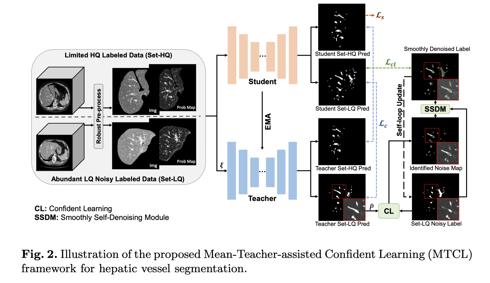

# Noisy Labels are Treasure: Mean-Teacher-Assisted Confident Learning for Hepatic Vessel Segmentation
为了利用噪声标签(noisy labels)，本文提出了MTCL. 在mean teacher的基础上设计了一个逐步自消噪的模块(progressively self-denoising module), 用于处理teacher的预测。处理后的结果与对应的student预测计算loss。

标准的半监督学习方法不能很好的利用噪声标签里的信息。对此作出改进的工作一般是图像层面的，无法利用像素级别的信息。

本文在MT架构中加入了置信学习(confident learning, 提出是为了在图像级别移除噪声标签)的策略，用来识别像素级别的噪声标签。得到了噪声图(noisy map)之后，本文的SSDM模块就能逐步消除低质量标签中的噪声。

<!-- TODO: L_{cl}是在每个step里都计算一次吗 -->

1. 预处理

2. 噪声标签去噪后监督student model
    1. Characterize the pixel-wise label errors via adapted CL: 先用teacher的预测(概率值)和该图像对应的标签计算一个混淆矩阵(confusion matrix), 进一步计算噪声标签和(潜在的)真实标签之间的联合概率矩阵。然后在每个类别里选择置信度低的像素，把它们当作错误标签，得到噪声分布图(noisy map)
    2. Smoothly refine the noisy labels of Set-LQ to provide rewarding supervision: 对噪声分布图上的标签不完全地取反
    3. Self-loop updating: 每个epoch里，把噪声标签替换成修正后的标签，用作下一个epoch的训练过程

# Anti-Interference From Noisy Labels: MeanTeacher-Assisted Confident Learning for Medical Image Segmentation
改进了上一篇文章的label-refinement过程: 结合Monte Carlo Droupout，逐像素计算teacher model的熵，用来衡量不确定性。然后在对噪声分布图上的标签取反的时候(即label-refinement), 为不确定性大的像素分配小的权重。作为对比，上文smoothly refine的过程里，权重是固定的。