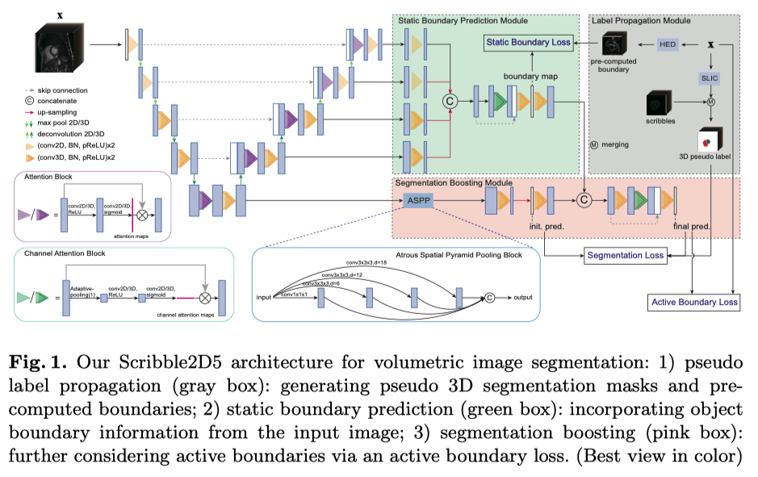

# Scribble2D5: Weakly-Supervised Volumetric Image Segmentation via Scribble Annotations
涂鸦注释的一个缺点是难以准确定位ROI(region of interest)的边界。此外，先前的方法通常是为二维图像设计的，不能充分利用整个图像体积，切片之间缺乏连续性。

为了解决以上问题，本文提出了基于UNet2D5的网络Scribble2D5, 包含一个用于生成3D伪标签的标签传播模块，和一个用于正则化3D分割结果的主动边界损失函数。

- 3D伪标签生成：用SCIC生成超体素(supervoxels), 然后选择涂鸦标签经过的那些超体素，得到3D伪分割掩码。
- ROI的伪静态边界生成：通过堆叠每个2D切片上的边界。2D边界由边缘检测算法[HED](https://blog.csdn.net/u011447369/article/details/98957649)获得。
- 主干网络：UNet2D5，并且在每个deconvolutional layer处假设一个注意力块. (Specifically, at the top two layers of both encoder and decoder branches, we have 2D convolutional operations; while at other layers, the feature maps are isotropic)
- 静态边界预测模块(SBPM)：如图
  <!-- SBPM本质上也是一种consistency regulation -->
- 分割增强模块(SBM): 
- 主动边界(Active Boundary)损失：把2D的主动轮廓损失([active countour loss](https://zhuanlan.zhihu.com/p/77551832))升级成3D.