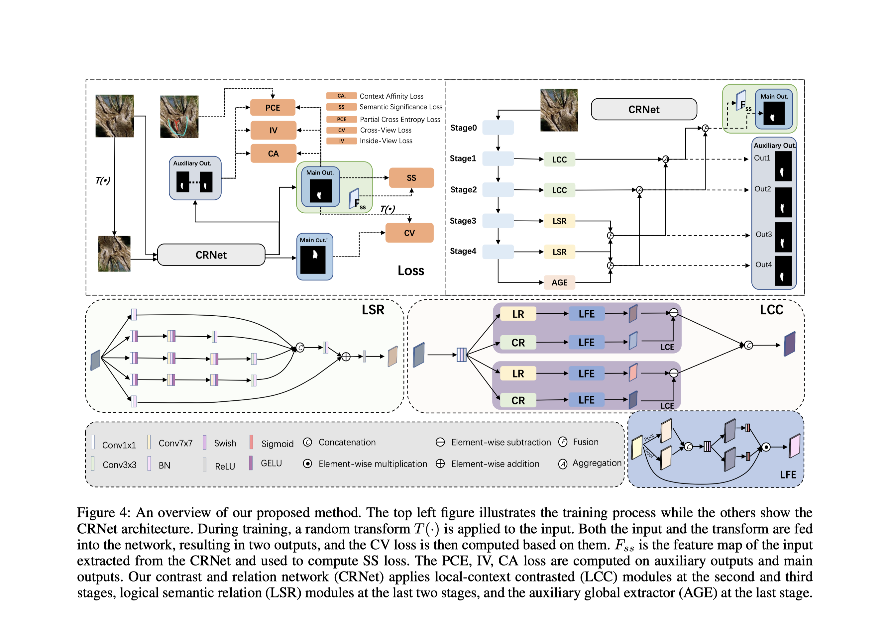

[Weakly-Supervised Camouflaged Object Detection with Scribble Annotations](https://arxiv.org/abs/2207.14083)

# Motivation
对于伪装物体检测(Camouflaged object detection, COD)任务，逐像素的标注不仅成本高，且无法区分像素的重要性。

因此，作者发布了第一个基于涂鸦标注的COD数据集(S-COD)。同时，由于已有的弱监督COD网络应用在涂鸦标注数据上时，都无法准确识别边界和语义联系，作者提出了第一个基于涂鸦标注的端到端COD网络。

# Details

## Network Structures
### Local-Context Contrasted (LCC) Module
为了利用低层级信息 (e.g., 纹理、颜色、强度) 把伪装物体和背景区分开，作者设计了可以捕获并加强低层级差异的模块 LCC。

LCC中的低级对比提取器 (low-level contrasted extractor, LCE) 包含两个具有不同感受野的低级特征提取器 (low-level feature extrator, LFE), 分别通过交叉空间和通道注意力机制 (crossing spatial and channel attention mechanism) 提取局部和上下文特征 (local and context features) 。

为了进一步增强对比，每个LCC中有两个LCE。

### Logical Semantic Relation (LSR) Module
为了利用逻辑语义关系来识别真正的前景和背景，作者设计了LSR模块，通过整合多个感受野不同分支的信息来获取复杂的语义信息。

## Loss Functions
### Feature-guided Loss: $L_{ft}=L_{ca}+L_{ss}$
基于涂鸦标签的网络表现通常受限于物体信息的不足。以往的解决办法基于“前景和背景有可明显区分的特征”这一假设，但是这不适用于COD。因此，作者设计了特征主导的损失函数，同时考虑简单的视觉特征 (CA loss) 和复杂的语义特征 (SS loss)。
- **Context Affinity (CA) Loss** $L_{ca}$: 距离相近、特征相似的像素更有可能属于同一类别。作者设计的损失函数同时度量了两个像素的视觉特征相似性和属于不同类别的可能性，使模型可以更快地从无标注像素上学习。
  <!-- - 度量视觉特征相似度：$K_{vis}(i,j)=exp(-\frac{\|S(i)-S(j)\|_2}{2\sigma^2_S}-\frac{\|C(i)-C(j)\|_2}{2\sigma^2_C})$
  - 度量两个像素属于不同类别的可能性：$D(i,j)=1-P_iP_j(1-P_i)(1-P_j)$, $P_i$ 是像素i有正标签的概率。
  - $L_{ca}=\frac{1}{M}\sum_i \frac{1}{K_d(i)}\sum_{j\in K_d(i)}K_{vis}(i,j)D(i,j)$ -->

- **Semantic Significance (SS) Loss** $L_{ss}$: 在COD中，语义特征对于准确检测至关重要，因为边界附近的视觉特征通常很相似。因此，SS Loss在小的边界区域内计算。(边界区域：至少30%的像素被明确分类为前景或背景的区域（涂鸦注释或模型预测值高于 0.8 的像素称作“被明确分类”）)。

  这样做的好处在于：第一，非边界区域的低级视觉特征已经足够作指导；第二，这样计算可以显著降低计算成本。

### Consistency Loss: $L_{cst}=L_{cv}+L_{iv}$
弱监督学习方法的效果通常受限于不一致的预测。
- **Cross-view (CV) Consistency Loss** $L_{cv}$: 最小化输入图像和变形 (transformation) 之间的差异。
- **Inside-view (IV) Consistency Loss** $L_{iv}$: 不确定的 (uncertain) 预测很可能是不一致的。因此，作者提出了IV Loss，使高确定性预测的熵尽可能小 (a.k.a. 鼓励模型生成确定的预测); 还使用了一个软指标来过滤噪声预测 (熵值高于某个阈值 = 预测结果不确定)。

  这个损失函数在训练的后期加入，此时模型的预测已经相对来说比较准确。

### Objective Function
$$L=L_{cst}+L_{ft}+L_{pce}+\sum_{i=1}^4\beta_i L_{aux}^i,\quad \beta_i=1-0.2i$$

# Experiments